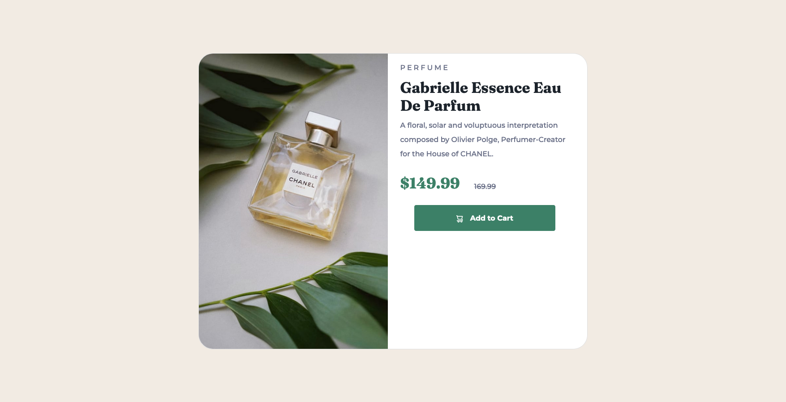

# Frontend Mentor - Product preview card component solution

This is a solution to the [Product preview card component challenge on Frontend Mentor](https://www.frontendmentor.io/challenges/product-preview-card-component-GO7UmttRfa). Frontend Mentor challenges help you improve your coding skills by building realistic projects. 

## Table of contents

- [Overview](#overview)
  - [The challenge](#the-challenge)
  - [Screenshot](#screenshot)
  - [Links](#links)
- [My process](#my-process)
  - [Built with](#built-with)
  - [What I learned](#what-i-learned)
  - [Continued development](#continued-development)
  - [Useful resources](#useful-resources)
- [Author](#author)
- [Acknowledgments](#acknowledgments)

**Note: Delete this note and update the table of contents based on what sections you keep.**

## Overview

### The challenge

Users should be able to:

- View the optimal layout depending on their device's screen size
- See hover and focus states for interactive elements

### Screenshot

### Links

- Solution URL: https://github.com/cjdemille/Product-Preview-Card-Component-.git
- Live Site URL: https://cjdemille.github.io/Product-Preview-Card-Component-/

## My process

I decided to use the card component of Bootstrap to give me a head start on the layout. I used the bootstrap card framework to develop the mobile layout. Once the elements were in place, I updated the colors and fonts to fit the guidelines. Then I worked out the line spacing for the card text and the tracking for the category label of perfume. 

Then I created a the desktop card component using the elements from the mobile design.

### Built with

- Semantic HTML5 markup
- CSS custom properties
- Flexbox
- Bootstrap 5
- Mobile-first workflow

### Continued development

I think the area I'd look at improving most is creating a breakpoint between the mobile and desktop views to handle tablet viewers. I also may play around with the button location on the desktop view.  

## Author

- Website - [CJ DeMille](https://www.cdemille.com)
- Frontend Mentor - [@cjdemille](https://www.frontendmentor.io/profile/cjdemille)

